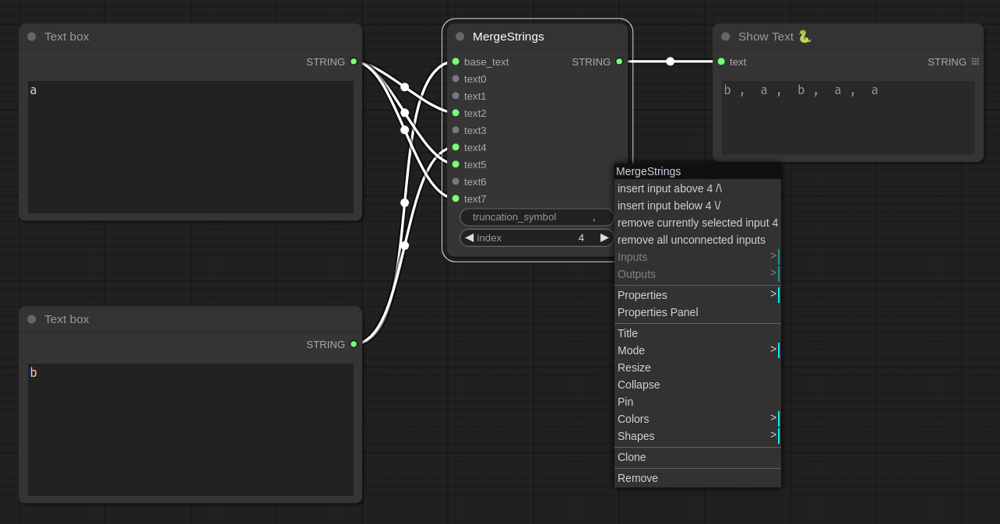
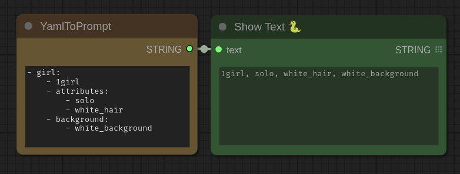
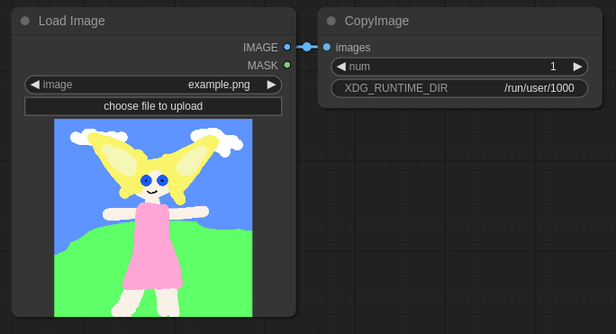
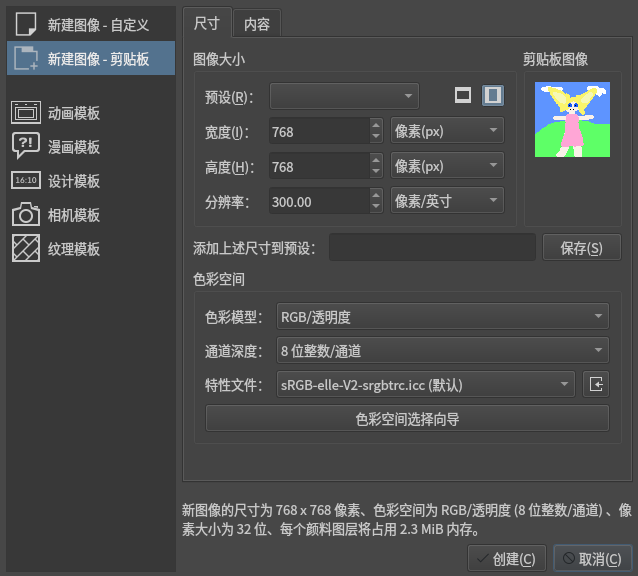

# ComfyUI_WcpD_Utility_Kit
ComfyUI的自定义节点,正在建设
## 功能:
### text
#### MergeStrings
把字符串合并,并可在右键菜单更改输入数

#### YamlToPrompt
将Yaml格式转换为逗号分隔的形式，便于查看与编辑

### image
#### CopyImage(Wayland)
复制图片到系统剪贴板  
需要安装`wl-copy`,以及设置`XDG_RUNTIME_DIR`*（可选）*


### debug
#### ExecStrAsCode
执行字符串,输入与输出都是元组 
(目前不怎么好用)

## TODO
PrintEverything: 打印一切到控制台  
PackIntoList: 接受所有类型的对象, 打包成一个列表(或者元组)
## 安装
```shell
cd ComfyUI/custom_nodes
git clone https://github.com/doucx/ComfyUI_WcpD_Utility_Kit.git #Or whatever repo here
```
