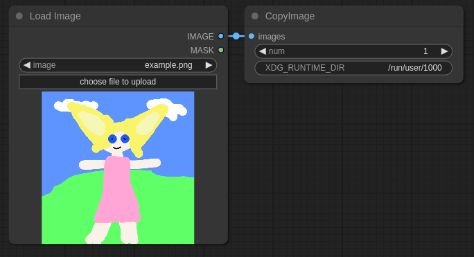

# ComfyUI_WcpD_Utility_Kit
> This English version is translated by ChatGPT  

[Chinese Documentation](./README.md)  
Custom nodes for ComfyUI, currently under construction.
## Features:
### text
#### MergeStrings
Merge strings and change input numbers in the right-click menu.

#### YamlToPrompt
Convert Yaml format to comma-separated format for easy viewing and editing.

### image
#### CopyImage(Wayland)
Copy images to the system clipboard, only support wayland.
Requires installation of `wl-copy` and setting `XDG_RUNTIME_DIR` *(optional)*.


### debug
#### ExecStrAsCode
Execute a string; both input and output are tuples.
(Currently not very user-friendly)

## TODO
PrintEverything: Print everything to the console.  
PackIntoList: Accept objects of all types, pack them into a list (or tuple).
## Installation
```shell
cd ComfyUI/custom_nodes
git clone https://github.com/doucx/ComfyUI_WcpD_Utility_Kit.git
```
